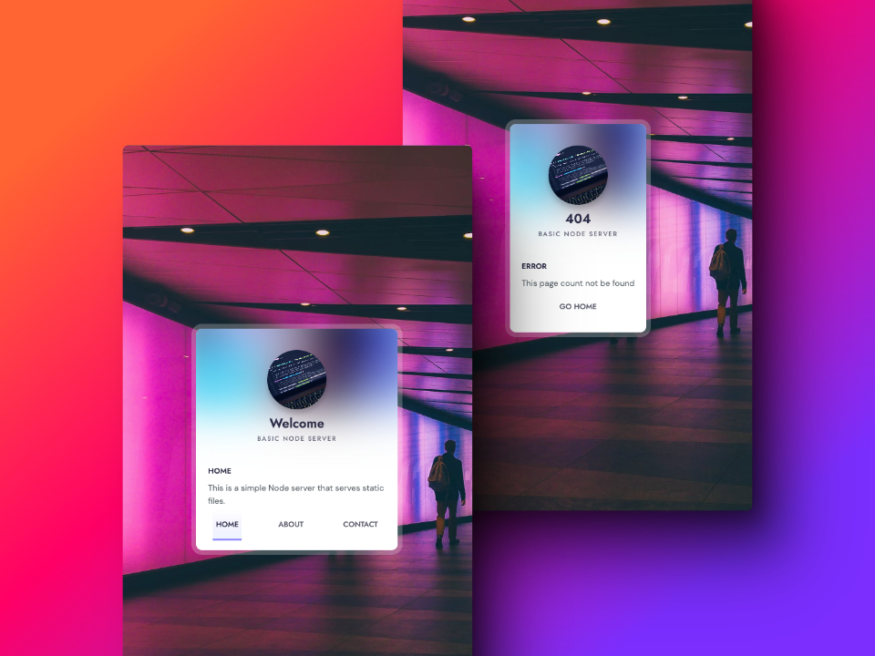

# Basic Node Server

This is a basic Node.js server that serves static files. It is designed to serve HTML, CSS, and other static files from the file system.



### Prerequisites

- Node.js installed on your machine

### Getting Started

1. Clone the repository:
   ```sh
   git clone <repository-url>
   ```
2. Navigate to the project directory:
   ```sh
   cd basic-node-server
   ```
3. Start the server:
   ```sh
   node index.js
   ```
